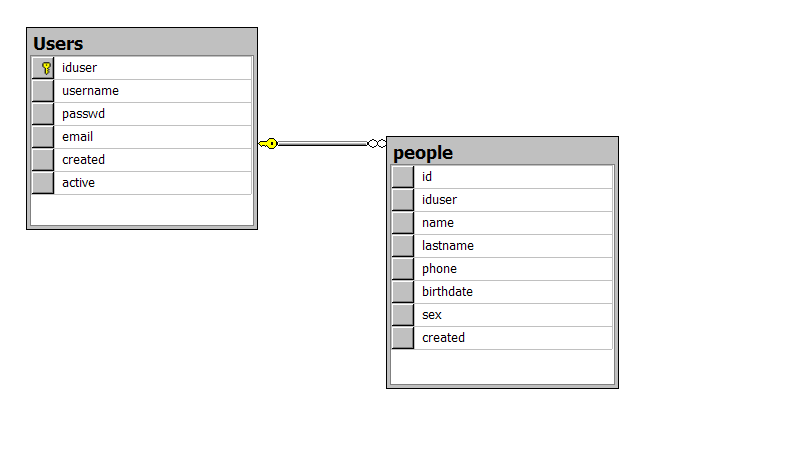

# User Identification and Authentication with Transact-SQL

Doing user authentication in SQL Server can be customized; you can use all kinds of data from a database to authenticate users. Every application needs to deal with security, making sure that sensitive data cannot be accessed by the wrong users. You can write your own custom logic to verify user names and passwords and make sure the information is stored.

<b>Fig 1. The database diagram.</b>

In the database under a secure account with a password that couldn't easily be guessed by a user. The easiest way to accomplish this is to one-way encrypt user passwords on store procedure.

<pre>
USE [Posts]
GO

DECLARE	@return_value int

EXEC	@return_value = [dbo].[createUser]
		@prmUsername = N'martin1',
		@prmPassword = N'qwerty123',
		@prmEmail = N'martin@email.com',
		@prmName = N'Martin',
		@prmLastName = N'Ortega',
		@prmPhone = N'123-456-78',
		@prmBirthDate = '11/11/2011',
		@prmSex = 1

SELECT	'Return Value' = @return_value

GO
</pre>

This code will insert one row, corresponding to the new user, in the users table. The SQL Server way to store passwords is by wrapping them in a built-in encrypting function called HASHBYTES .

<pre>
iduser                               username         passwd                                                           email                                                            created    active
------------------------------------ ---------------- ---------------------------------------------------------------- ---------------------------------------------------------------- ---------- ------
5E04273B-C3C9-4C3E-9A4E-BF66382440F4 martin1          \ì[^=^bÉá<èHïoêÈÿ                                             martin@email.com                                                 2024-10-24 1

(1 row(s) affected)
</pre>

